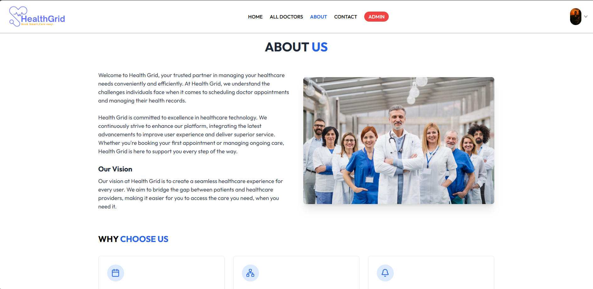
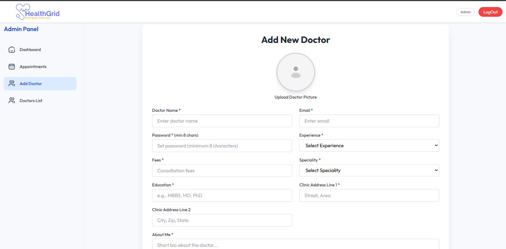
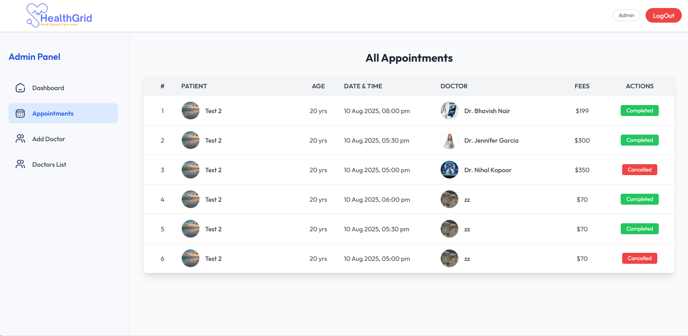
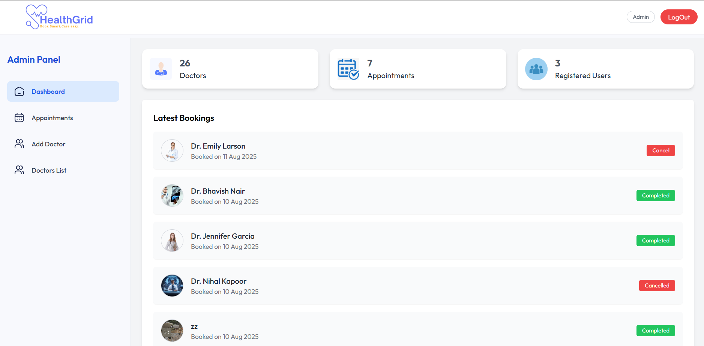
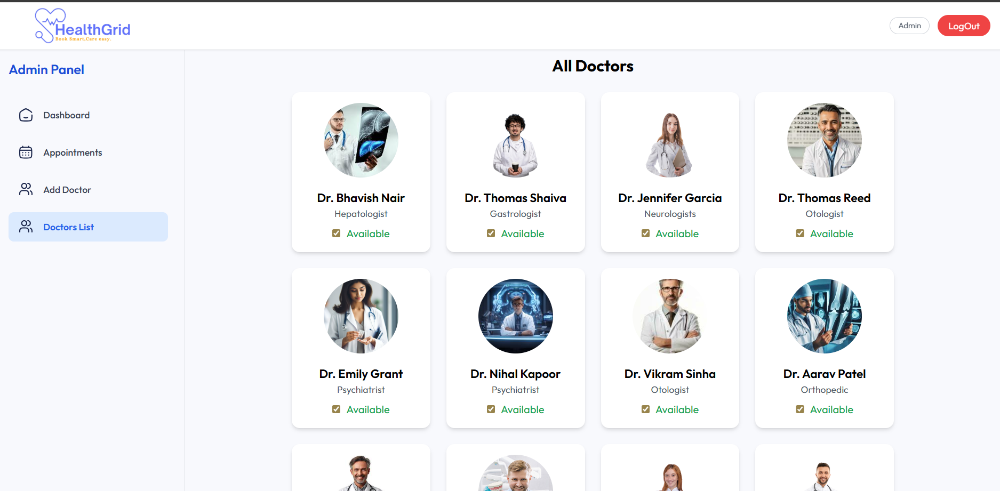
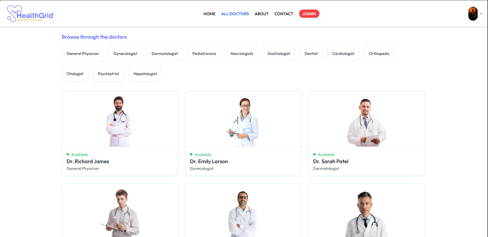
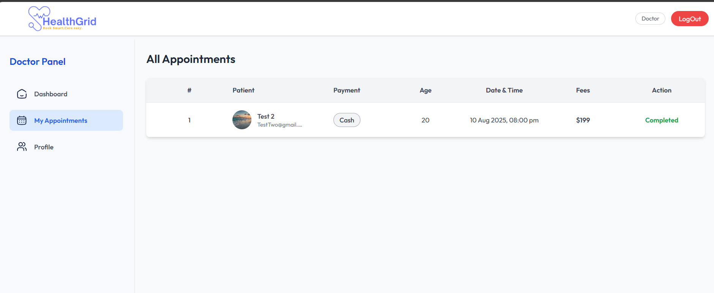
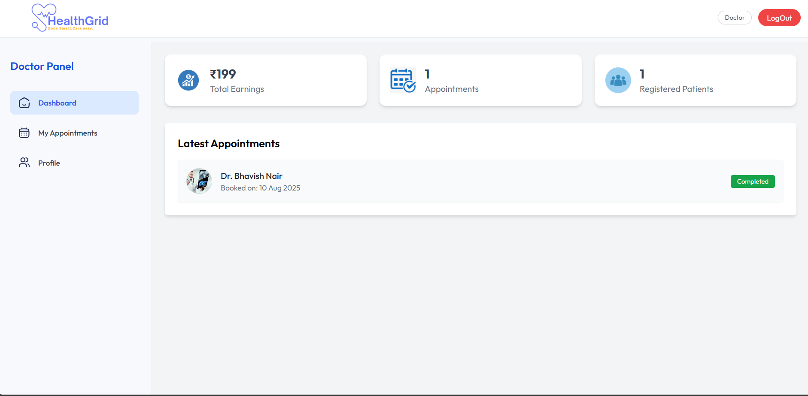
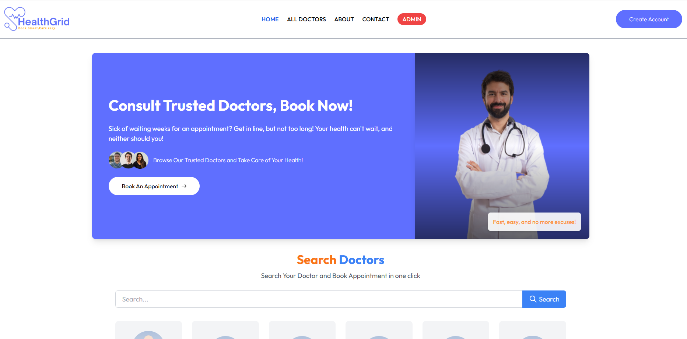
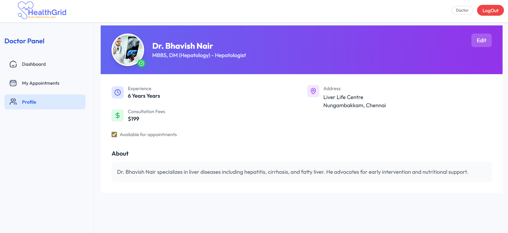

Sure! Here's the **entire README content in a single code block** for easy copying into your environment:

````markdown
# Doctor Appointment Booking System (MERN)

A full-stack doctor appointment booking application built with **MongoDB, Express, React, and Node.js** allowing patients to book appointments, doctors to manage schedules, and admins to oversee the system.

---

## Features

- User registration and login with roles (Patient, Doctor, Admin)  
- Patients can browse doctors and book appointments  
- Doctors can view and manage appointments  
- Admins can manage users and appointments  
- Responsive, user-friendly interface

---

## Technologies Used

- Frontend: React, React Router, Tailwind CSS (or your CSS framework)  
- Backend: Node.js, Express.js  
- Database: MongoDB with Mongoose  
- Authentication: JWT (JSON Web Tokens)

---

## Getting Started

### Prerequisites

- Node.js (v14+)  
- MongoDB (local or cloud)  
- npm or yarn package manager

### Installation

1. Clone the repo and navigate to the project root.  
2. Install backend dependencies:

   ```bash
   cd backend
   npm install
````

3. Install frontend dependencies:

   ```bash
   cd ../frontend
   npm install
   ```

4. Setup `.env` file in backend folder:

   ```
   PORT=5000
   MONGO_URI=your_mongodb_connection_string
   JWT_SECRET=your_jwt_secret_key
   ```

5. Start backend server:

   ```bash
   npm start
   ```

6. Start frontend app:

   ```bash
   cd ../frontend
   npm start
   ```

7. Visit [http://localhost:3000](http://localhost:3000) in your browser.

---

## Usage

* Register as a patient, doctor, or admin.
* Patients can book appointments with doctors.
* Doctors can manage their schedules.
* Admins can manage the system users and appointments.

---
## Screenshots

<table>
  <tr>
    <td><br><em>About Us page</em></td>
    <td><br><em>Admin Add Doctor</em></td>
    <td><br><em>Admin Appointments</em></td>
  </tr>
  <tr>
    <td><br><em>Admin Dashboard</em></td>
    <td><br><em>Admin Doctor List</em></td>
    <td><br><em>All Doctors (After Login)</em></td>
  </tr>
  <tr>
    <td><br><em>Doctor Appointments</em></td>
    <td><br><em>Doctor Dashboard</em></td>
    <td><br><em>Home Page (Before Login)</em></td>
  </tr>
  <tr>
    <td><br><em>Doctor Profile</em></td>
    <td></td>
    <td></td>
  </tr>
</table>
