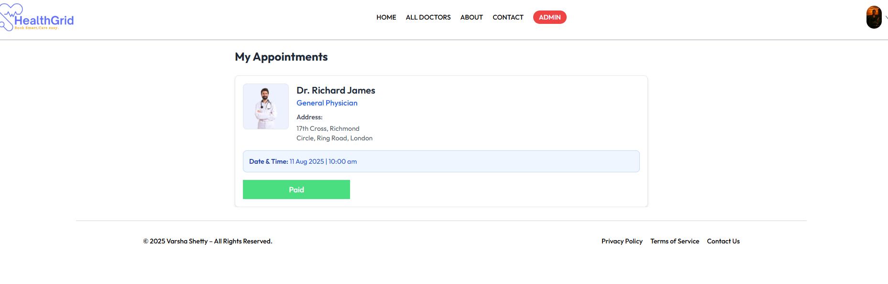
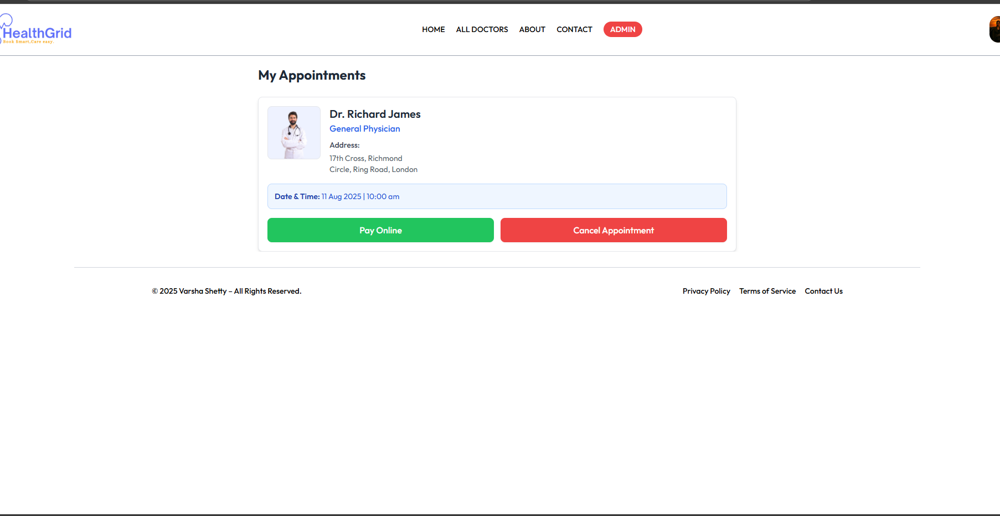
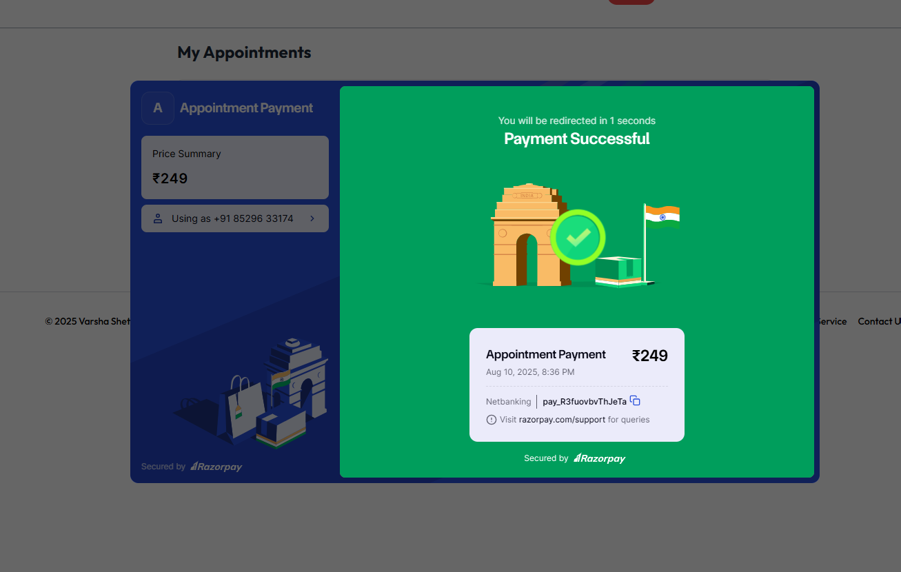

# Doctor Appointment Booking System (MERN)

A full-stack doctor appointment booking application built with **MongoDB, Express, React, and Node.js** allowing patients to book appointments, doctors to manage schedules, and admins to oversee the system.

---

## Features

- User registration and login with roles (Patient, Doctor, Admin)  
- Patients can browse doctors and book appointments  
- Doctors can view and manage appointments  
- Admins can manage users and appointments  
- Responsive, user-friendly interface

---

## Technologies Used

- Frontend: React, React Router, Tailwind CSS (or your CSS framework)  
- Backend: Node.js, Express.js  
- Database: MongoDB with Mongoose  
- Authentication: JWT (JSON Web Tokens)

---

## Getting Started

### Prerequisites

- Node.js (v14+)  
- MongoDB (local or cloud)  
- npm or yarn package manager

### Installation

1. Clone the repo and navigate to the project root.  
2. Install backend dependencies:

   ```bash
   cd backend
   npm install
3. Install frontend dependencies:
   cd ../frontend
   npm install
4.Setup .env file in backend folder:
   PORT=5000
   MONGO_URI=your_mongodb_connection_string
   JWT_SECRET=your_jwt_secret_key
5.Start backend server:
   npm start
6.Start frontend app:
   cd ../frontend
   npm start
   
Visit http://localhost:3000 in your browser.

Usage
Register as a patient, doctor, or admin.

Payment gateway using Razorpay — users can pay online or opt for cash.

Patients can book appointments with doctors.

Doctors can manage their schedules.

Admins can manage the system users and appointments.

## Screenshots

<div style="display: flex; justify-content: space-between; flex-wrap: wrap;">

  <div style="flex: 0 0 48%; margin-bottom: 20px;">
    
    <p><em>About Us page</em></p>
  </div>

  <div style="flex: 0 0 48%; margin-bottom: 20px;">
    
    <p><em>Admin Add Doctor</em></p>
  </div>

  <div style="flex: 0 0 48%; margin-bottom: 20px;">
    
    <p><em>Admin Appointments</em></p>
  </div>

  <div style="flex: 0 0 48%; margin-bottom: 20px;">
    
    <p><em>Admin Dashboard</em></p>
  </div>

  <div style="flex: 0 0 48%; margin-bottom: 20px;">
    
    <p><em>Admin Doctor List</em></p>
  </div>

  <div style="flex: 0 0 48%; margin-bottom: 20px;">
    
    <p><em>All Doctors (After Login)</em></p>
  </div>

  <div style="flex: 0 0 48%; margin-bottom: 20px;">
    
    <p><em>Doctor Appointments</em></p>
  </div>

  <div style="flex: 0 0 48%; margin-bottom: 20px;">
    
    <p><em>Doctor Dashboard</em></p>
  </div>

  <div style="flex: 0 0 48%; margin-bottom: 20px;">
    
    <p><em>Home Page (Before Login)</em></p>
  </div>

  <div style="flex: 0 0 48%; margin-bottom: 20px;">
    
    <p><em>Doctor Profile</em></p>
  </div>

  <div style="flex: 0 0 48%; margin-bottom: 20px;">
    
    <p><em>Appointments Paid</em></p>
  </div>

  <div style="flex: 0 0 48%; margin-bottom: 20px;">
    
    <p><em>My Appointments Page</em></p>
  </div>

  <div style="flex: 0 0 48%; margin-bottom: 20px;">
    
    <p><em>Payment Page</em></p>
  </div>

</div>

 ```
